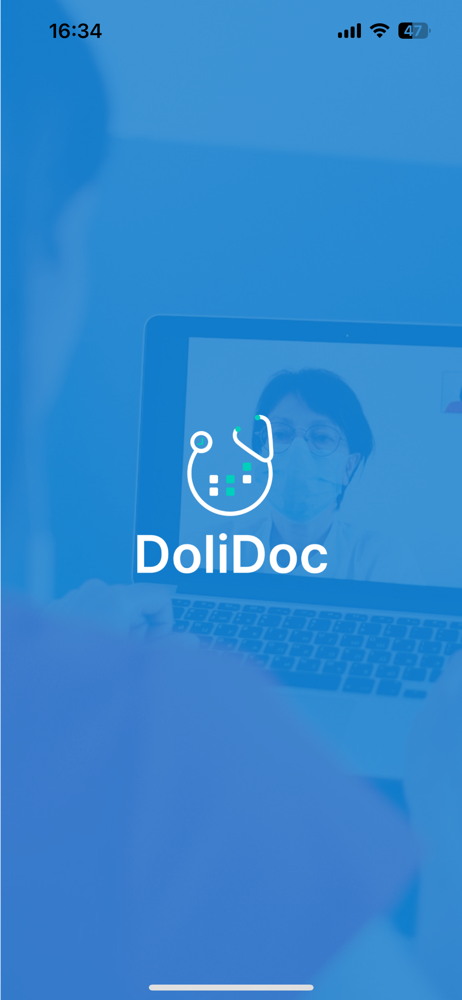

# Dolidoc (Frontend)

Dolidoc is a cross-platform doctor appointment and calendar management application designed for clinics and doctors to streamline bookings, notifications, and profile handling. This repository contains the **frontend-only** codebase built in **TypeScript** and **React Native/Expo**, organized to demonstrate code quality and architecture for academic and professional review.

> ⚠️ **Disclaimer**: This repository contains only the publicly shareable portion of the application — the **frontend code** — for thesis and code review purposes. The **complete production app**, including backend services and sensitive logic, is under review and pending approval for deployment on the **App Store** and **Google Play Store**. That full source code is private.

---

## Project Structure Overview

The code is modular and role-based, designed with scalability and maintainability in mind. Below is an overview of key folders and their responsibilities:

###  `admin/`
Admin dashboard for internal analytics and management (for app owner use only):
- `Clinics.tsx`, `Doctors.tsx`, `Revenue.tsx`: Admin-facing overviews
- `_layout.tsx`, `index.tsx`: Screen layout and navigation
- `adminScreens/`: Detailed views for clinics and doctors

###  `doctor/`
Doctor's section:
- `CalendarScreen.tsx`, `appointments.tsx`: Doctor’s calendar and appointments
- `notifications.tsx`, `profile.tsx`: Notifications and profile

### `clinics/`
Clinic user section:
- `doctors.tsx`: View affiliated doctors
- `profile.tsx`, `notifications.tsx`: Clinic notifications and profile

###  `auth/`
Authentication logic:
- `role/SelectRole.tsx`: Choose between doctor, clinic, patient
- `signin/`, `signup/`: Sign in and registration flows

###  `aboutApp/`
Legal and versioning info:
- `PrivacyPolicy.tsx`, `TermsofService.tsx`, `AppVersionInfo.tsx`

###  `addDoctor/` & `addClinic/`
Flows for adding doctor/clinic users (forms and profiles).

###  `Functions/`
- `SyncGoogleCalendar.ts`: Logic for syncing external calendars

###  `doctorProfileView/`, `clinicDocProfile/`, `patientProfileView/`
Dedicated profile view logic for each role.

###  `mainscreen/`
Shared screens used across roles:
- Appointments, Calendar, Notifications, Profile

### 🧑‍⚕ `patient/`
Patient-facing screens:
- Booking appointments, viewing doctor details, calendar, profile

###  `profileSetting/`
Profile management (availability, personal info)

###  `subscription/`
Subscription and payment flows (Apple Pay, Bank Transfer, etc.)

###  `services/`
- `userService.ts`: Service functions to manage user data

---

## Tech Stack

- **TypeScript**
- **React Native** with **Expo**
- Modular screen-based architecture
- Organized by **role-based access**

## Dolidoc Frontend Demo

Click the image above to watch a quick walkthrough of the main features and user interface.

